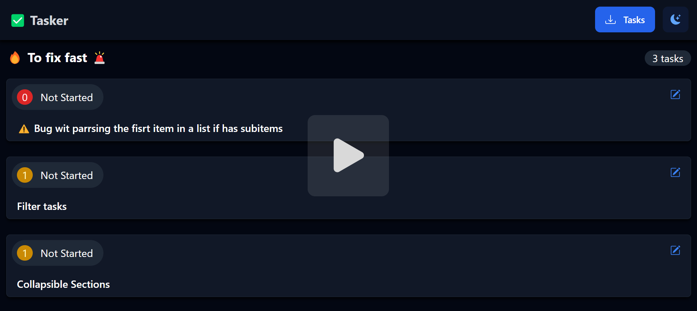

# ✅ TASKER

Simplify your microtasking and boost your productivity with Tasker today.

Microtasking can often be a challenge, but it doesn't have to be.

Introducing Tasker, the ultimate solution to streamline your workflow. Tasker
effortlessly converts simple Markdown into a comprehensive task list JSON,
allowing you to easily edit and monitor your tasks directly within your
repository.

Ready to make microtasking easy? Try Tasker now and experience the difference!

[](https://youtu.be/oV8gtK-cxoo)

[_check how to video on youtube_](https://youtu.be/oV8gtK-cxoo)

## 😇 Why?

**Convert markdown to tasks.**

A task will be created from every list item with a priority set in square
brackets, like below:

```
- [1] Task priority 1
- [0] Task priority 0
```


Use **Live Server** in VSCode to see the tasks.

The example is from this README.md

## 💪 How?

### DEV mode

1. run: npx tailwindcss -i ./src/input.css -o ./src/output.css --watch
1. live server the **index.html**
1. Choose one of the following options:

   1. drop a \*.md file where you added priorities on list items or
   1. drop an exported \*.JSON file

## Dev status

### 🎉 Done

- ✅ Add to local storage
- ✅ Export from local storage
- ✅ Reset local storage
- ✅ Edit status
- ✅ Add notes
- ✅ Add tailwind
- ✅ better UI/UX
- ✅ Import JSON (drag and drop into the page to load a WIP Project)
- ✅ Fix light mode
- ✅ Parse tasks from sub list
  - ⚠️ only first and second level items are captured

## 🔥 To fix fast 🚨

- [0] ⚠️ Bug wit parsing the first item in a list if has subitems
- [1] Filter tasks
- [1] Collapsible Sections

## 📣 Coming soon:

- [2] Collapsible tasks
  - [2] collapse all
  - [2] expand all
- [3] Statistics

## 😢 Nice to have:

- [3] the possibility to save in the background the JSON file
- [3] search
- [3] enable/disable priorities
- [3] Fix Modal in dark mode
- [3] add multi level items (for now are only 2 levels)
- [3] Make it work on server as an APP
- [4] create a node module
  - [4] so it can be added to any repo and by running a command like "npm
    tasker" it will convert the README.md and open the tasker in a **localhost**
- [5] much better UI/UX

## 👄 Thanks

- [AlpineJS](https://alpinejs.dev/),
- [Tailwindcss](https://tailwindcss.com/),
- [Markdown-it](https://markdown-it.github.io/) and
- [Simplemde-markdown-editor](https://github.com/sparksuite/simplemde-markdown-editor)
